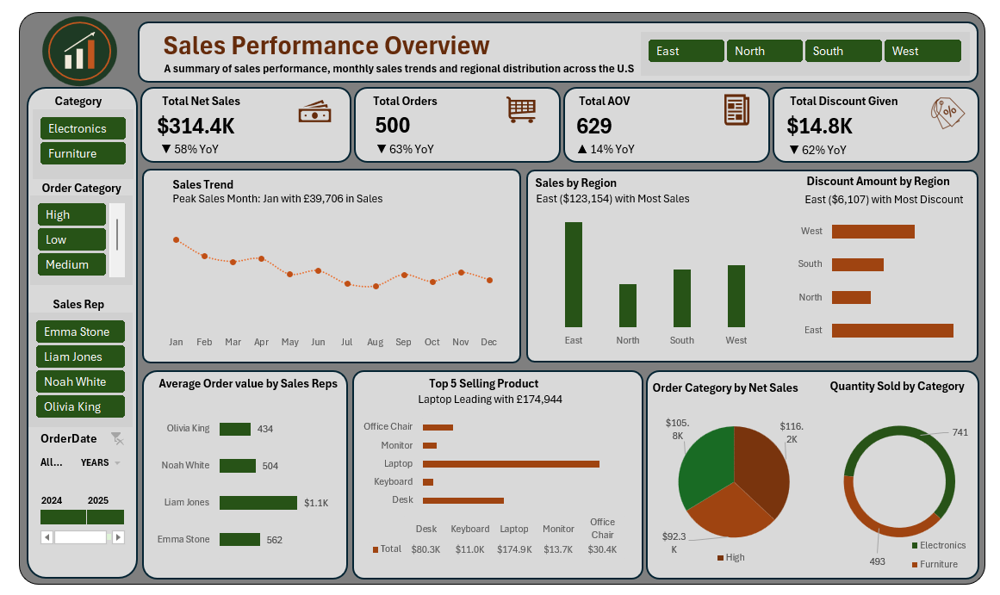

# Retail Sales Dashboard — Excel & Power Query

An interactive sales performance dashboard built entirely in Excel, covering 500 orders
across four regions, four sales reps, and two product categories. The workbook combines
a normalized data model, Power Query transformations, and PivotTable/PivotChart reporting
with slicers for interactive filtering.



## Business Questions

- What is our total net sales, order volume, and average order value, and how does each compare year over year?
- Which region and which sales reps are driving the most (and least) revenue?
- Which products sell best, and how does discounting vary by order size?
- How is sales volume trending month to month?

## Data Model

Rather than one flat spreadsheet, the workbook is structured as a small star schema:

| Table | Role | Rows |
|---|---|---|
| `Retail_Sales_Data` | Fact table — one row per order | 500 |
| `Customer` | Dimension — name, region, country | 20 |
| `Product` | Dimension — category, unit price, manufacturer | 20 |
| `SalesRep` | Dimension — region, experience level | 15 |

The three dimension tables are merged into the fact table via Power Query, so every order
carries its customer's country/region, the product's category and price, and the assigned
rep's region and experience level — without repeating that lookup logic in every formula.

## Data Cleaning & Calculated Fields

- **Missing quantity handling:** 39 of 500 orders (7.8%) had a missing `Quantity` value.
  Rather than defaulting these to zero or silently dropping them, each is flagged
  `Quantity Flag = "Missing Quantity"` and excluded from sales calculations, so they're
  visible for follow-up rather than hidden in the numbers.
- **Order Category tiers:** each order is bucketed into `Low` / `Medium` / `High` based on
  order value, used to slice the dashboard by order size.
- **Net Sales:** calculated as `Total Sales − Discount` per line, not just gross revenue.
- **Order Status:** every order is tagged `Completed`, `Pending`, or `Cancelled` — of the
  500 orders, 306 completed, 157 pending, and 37 cancelled.

## Dashboard Features

- **KPI cards:** Total Net Sales, Total Orders, Average Order Value, Total Discount Given —
  each with a year-over-year comparison indicator.
- **Trend chart:** monthly sales trend across the full order history.
- **Regional breakdown:** net sales and discount amount by region (bar and horizontal bar charts).
- **Sales rep performance:** average order value by rep.
- **Product performance:** top 5 selling products by net sales.
- **Category breakdown:** order category and quantity sold, split by product category.
- **Interactive filtering:** slicers for product category, order category (Low/Medium/High),
  sales rep, and order date (with a 2024/2025 year toggle).

## Tools Used

Excel · Power Query (data merging & transformation) · PivotTables & PivotCharts ·
Slicers · calculated fields

## Files

```
├── retail-sales-dashboard.xlsx  # Full workbook: data model, Power Query, dashboard
├── screenshots/
│   └── sales_dashboard.png    # Dashboard preview
└── README.md
```

