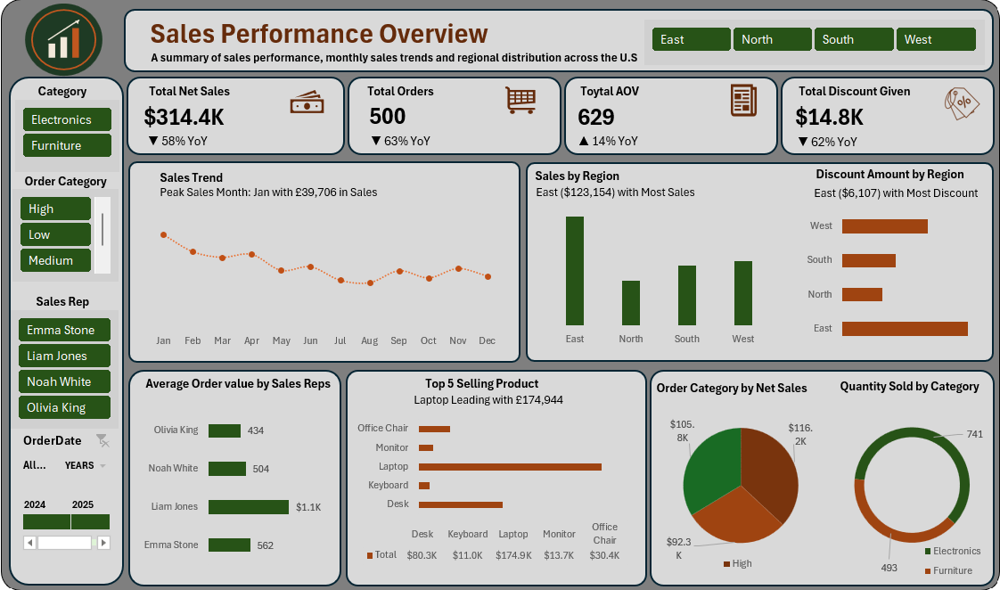
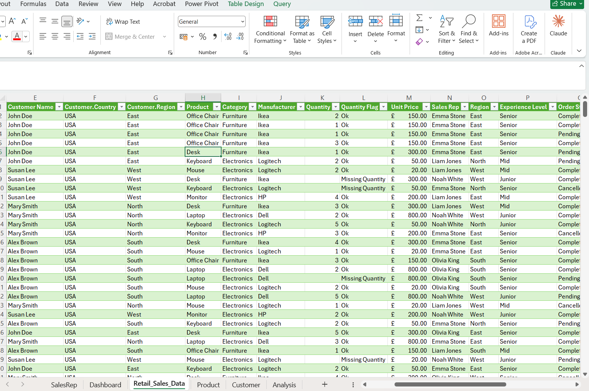
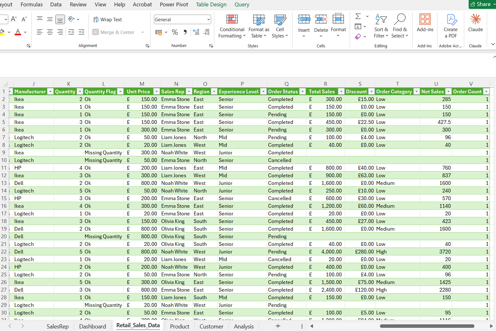
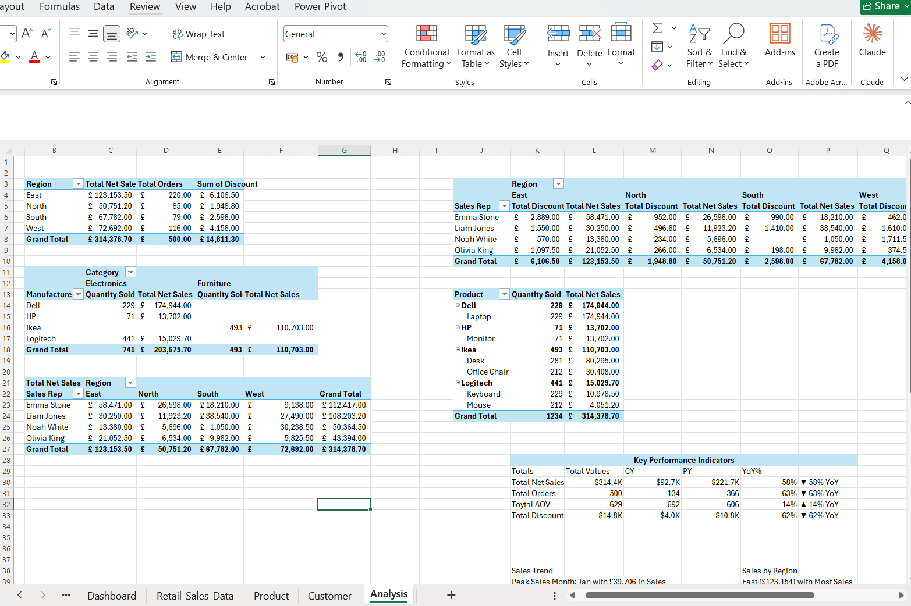
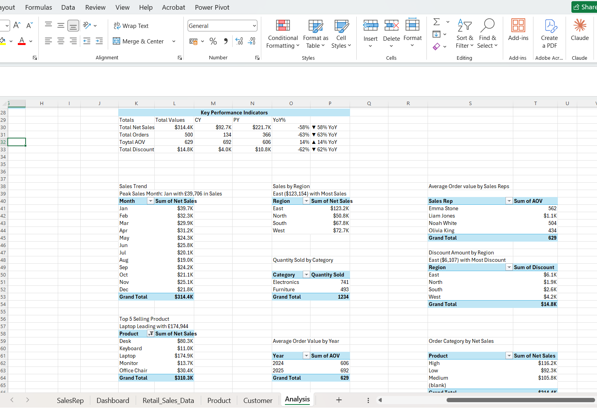

# 📊 Sales Performance Analysis & Strategic Insights — USA Market

## Table of Contents

- [Project Overview](#-project-overview)
- [Dashboard Preview](#-dashboard-preview)
- [Problem Statement](#-problem-statement)
- [Data Cleaning & Preparation](#-data-cleaning--preparation)
- [Exploratory Data Analysis](#-exploratory-data-analysis-eda)
- [Key Findings & Strategic Recommendations](#-key-findings--strategic-recommendations)
- [Tools & Techniques](#-tools--techniques)

---

## 📌 Project Overview

This project presents a **Sales Performance Dashboard** analyzing sales, profitability, customer orders, product performance, regional trends, discounts, and sales representative performance across the USA market.

The project transforms raw sales data into actionable business insights to identify growth opportunities, improve sales performance, and support data-driven strategic decisions.

---

## 🖼 Dashboard Preview

*Interactive Excel dashboard with slicers for Category, Order Category, Sales Rep, and Order Date, showing Net Sales, Orders, AOV, and Discount KPIs alongside regional and product breakdowns.*

---

## 🎯 Problem Statement

The analysis was designed to:

- Identify top-performing regions and products.
- Evaluate sales representative performance using **Average Order Value (AOV)**.
- Assess the effectiveness of discount strategies.
- Identify performance gaps and growth opportunities.
- Provide data-driven recommendations to improve revenue and profitability.

---

## 🖌 Data Cleaning & Preparation

### Issues Identified

- Missing values in key fields, such as **Quantity**.
- Inconsistent date formats and incorrect data types.
- Text inconsistencies causing duplicate entries, particularly in **Product Names**.

### Steps Taken

- Used **Power Query** to merge tables and enrich the dataset.
- Cleaned text using **Trim**, **Clean**, and **Proper** formatting.
- Converted columns to the correct data types, including **Date** and **Number**.
- Handled missing values appropriately, including replacing missing values with `0` where required.
- Created key analytical columns such as:
  - **Net Sales**
  - **Order Categories**

---

## 🔍 Exploratory Data Analysis (EDA)

### Key Business Questions Explored

1. Which regions are driving the highest sales and profitability, and where are performance gaps occurring?
2. Which products and product categories contribute the most to overall revenue and profit?
3. Which sales representatives are performing above or below expectations, and what patterns explain the differences?
4. How does **Average Order Value (AOV)** vary across regions, products and sales representatives?
5. Are discounts contributing to higher sales, or are they reducing profitability without generating sufficient returns?
6. How are sales and profit changing over time, and which periods show significant growth or decline?
7. Which areas of the business present the strongest opportunities for improving revenue, profitability and sales performance?

---

## 📈 Key Findings & Strategic Recommendations

### 1. 🏆 High-Performing Region

**Finding**
The **South Region** is the primary revenue driver, generating the highest Net Sales of **$95.8K**. This indicates strong customer demand and effective sales execution in the region.

**Recommendation**
- Allocate more marketing budget to the South through digital advertising and promotions.
- Increase inventory levels to reduce the risk of stockouts.
- Study successful sales practices in the South for possible application to other regions.

### 2. 💻 Top Product to Promote

**Finding**
**Laptops** generate the highest sales at **$174.6K**, significantly outperforming other products.

**Recommendation**
- Prioritize Laptops in major marketing campaigns.
- Maintain high inventory availability, particularly in the South Region.
- Use Laptops as a lead product to attract customers and encourage additional purchases.

### 3. 📦 Low-Performing Products — Lift Strategy

**Finding**
Products such as **Mouse, Keyboard and Monitor** generate comparatively lower sales.

**Recommendation**
- Bundle lower-performing products with high-performing products.
- Create packages such as **Laptop + Mouse** or complete **Laptop + Desk Setup** deals.
- Use targeted discounts selectively to increase demand for slow-moving products.

### 4. 👥 Sales Representative Coaching Opportunity

**Finding**
There is a clear variation in **Average Order Value (AOV)** across sales representatives. **Liam Jones** is the top performer with an AOV of approximately **$1.1K**, while other representatives range between approximately **$684** and **$368**.

**Recommendation**
- Analyze Liam Jones' sales approach, customer profile, and strongest-performing region.
- Use his approach as a benchmark for sales team training.
- Encourage the sales team to focus not only on the number of orders but also on increasing Average Order Value.

### 5. 💰 Discount Policy Review

**Finding**
The **East Region** has the highest discount amount at approximately **$5.9K**, yet it is not the top-performing region in sales. Approximately **6% of East Region sales** is given as discounts, suggesting that the current discount strategy may be reducing margins without generating proportional revenue growth.

**Recommendation**
- Shift toward targeted and performance-based discounts.
- Apply discounts strategically to slow-moving products rather than across-the-board.
- Avoid unnecessary heavy discounting in strong-performing regions such as the South, where customer demand is already strong.
- Monitor revenue generated per dollar of discount to measure discount effectiveness.

---

## 💡 Overall Business Takeaway

The analysis shows that **regional performance, product mix, sales representative effectiveness and discount strategy** have a significant impact on sales performance.

The business can improve revenue and profitability by **investing more in high-performing regions and products, replicating successful sales practices, improving cross-selling and applying discounts more strategically**.

---

## 🛠 Tools & Techniques

- **Microsoft Excel** — Data inspection and Visualization
- **Power Query** — Data cleaning, transformation and table merging
- **PivotTables** — Summarization and KPI calculation
- **Slicers** — Interactive filtering (Category, Order Category, Sales Rep, Order Date)
- **DAX-style Measures / Calculated Fields** — Net Sales, AOV, YoY%

